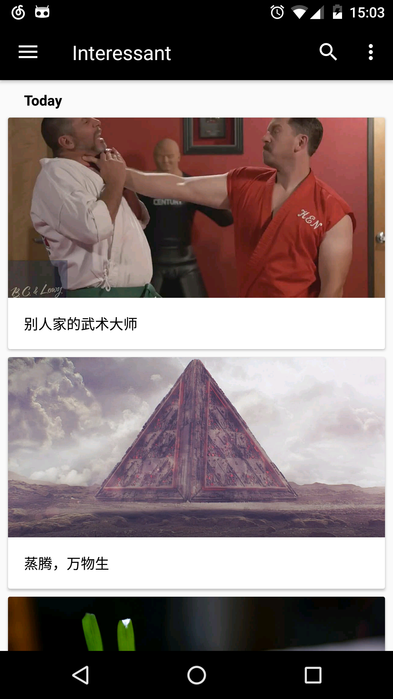
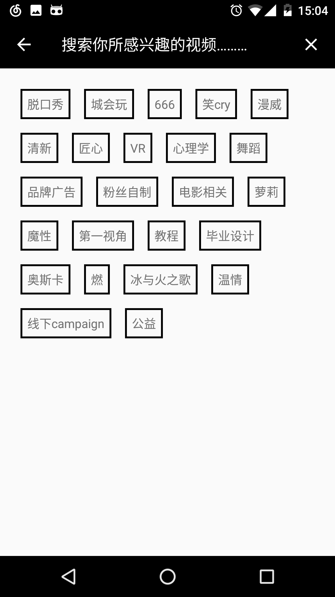
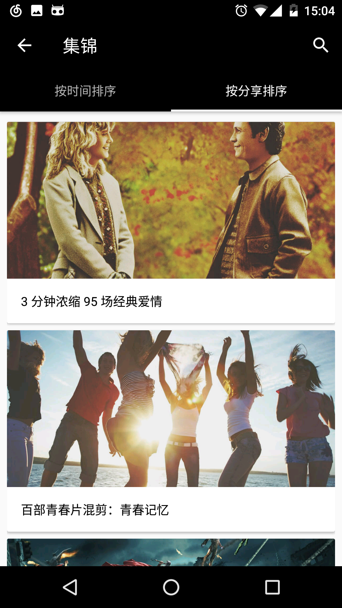
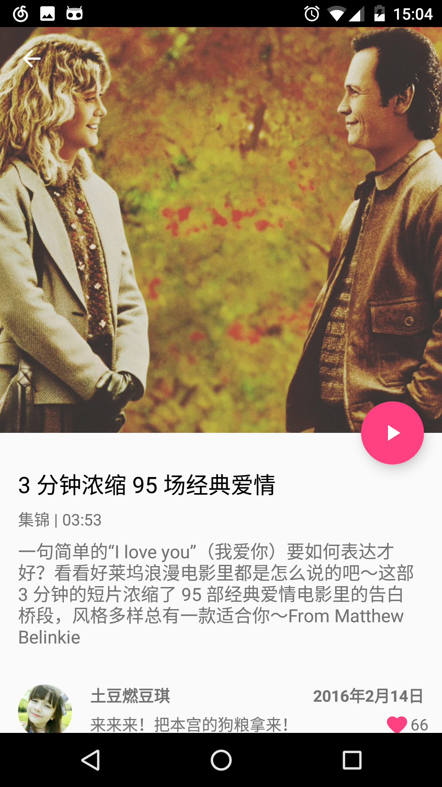
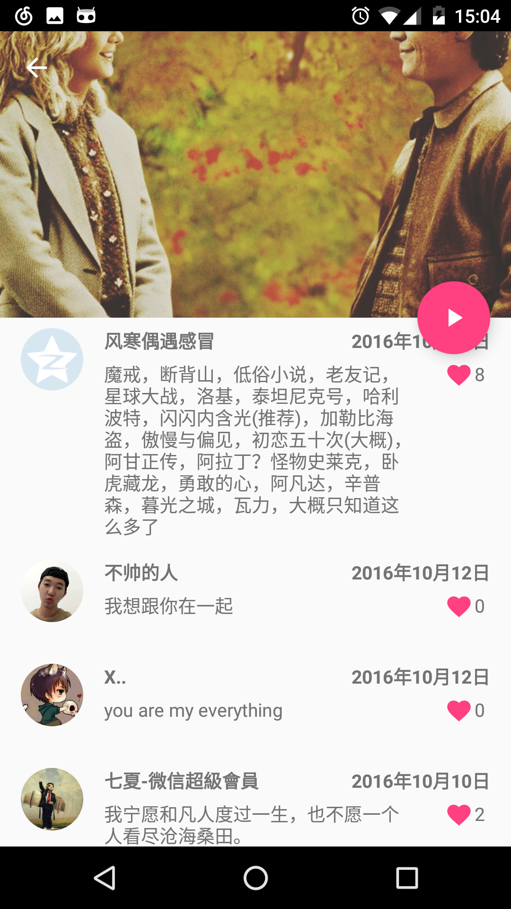
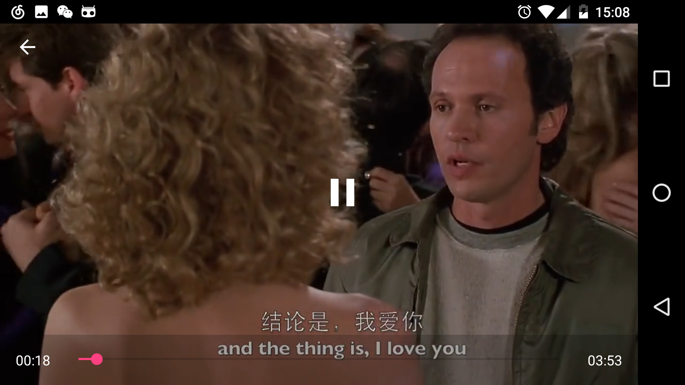

#Interessant
A simple, unofficial android client of Eyepetizer(开眼视频).

###Screenshot









###Libraries
```
compile 'com.android.support:appcompat-v7:24.2.0'
compile 'com.android.support:design:24.2.0'
compile 'com.android.support:cardview-v7:24.2.0'

compile 'com.squareup.retrofit2:retrofit:2.0.2'
compile 'com.squareup.okhttp3:okhttp:3.4.1'
compile 'io.reactivex:rxandroid:1.2.1'
compile 'com.squareup.retrofit2:converter-gson:2.0.2'
compile 'com.squareup.retrofit2:adapter-rxjava:2.0.2'
compile 'com.trello:rxlifecycle:0.7.0'
compile 'com.trello:rxlifecycle-components:0.7.0'

compile 'com.jakewharton.rxbinding:rxbinding-support-v4:0.4.0'
compile 'com.jakewharton.rxbinding:rxbinding-appcompat-v7:0.4.0'
compile 'com.jakewharton.rxbinding:rxbinding-recyclerview-v7:0.4.0'

compile 'com.github.bumptech.glide:glide:3.7.0'
compile 'com.squareup.picasso:picasso:2.5.2'
compile 'me.drakeet.multitype:multitype:2.0.0'

compile 'com.zhy:flowlayout-lib:1.0.3'
compile project(':vitamio')
```
###Thanks
[Plaid](https://github.com/nickbutcher/plaid)
[VitamioBundle](https://github.com/yixia/VitamioBundle)

###声明
Api 数据都是来自开眼视频，数据接口均属于非正常渠道获取，请勿用于商业用途，原作公司拥有所有权利。

###License
[Apache License 2](https://github.com/Assassinss/Interessant/blob/master/LICENSE)
